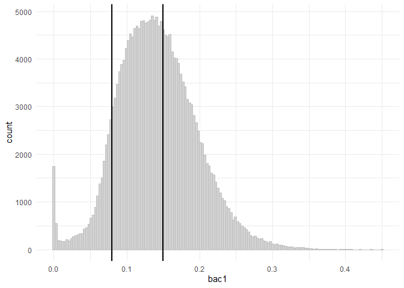
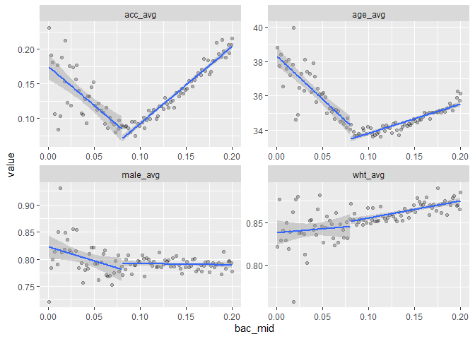

Assignment 2
================
Colin Wick
2/10/2021

Hansen (2015) uses panel BAC and police data to construct a regression
discontinuity model exploiting the “arbitrary” cutoffs of DUI
consequences at different BAC levels. The first task is establishing the
homogeneity and independence of BAC in order to validate that there is
no clustering around specific values, as shown in Figure 1. The BAC of
drivers is approximately normal with no evidence of bunching around
cutoffs.

Then, exploiting the underlying normality of BAC levels, he is able to
analyze differences between those who fell just above and just below a
given threshold and DUI recidivism. He finds a sharp drop in recidivism
along the first BAC cutoff (.08) and a weaker drop on the second.

He then does a handful of robustness checks and deeper looks into
recidivism, finding the effect is strongest for those whom had never
been tested and were caught above the .08 threshold but below the .15
threshold.

<!-- -->

    ## [1] "with P-value of McCrary tests 0.89 and 0.46 we fail to reject the null that there is no bunching around cutoffs"

Recreating Figure 1 from Hansen. A histogram of BAC shows there is no
visible evidence of bunching around either cutoff. Running the McCrary
test finds no statistical evidence either.

    ##                     male       white        age
    ## estimate     0.006184234 0.005703740 -0.1404517
    ## se           0.005703634 0.005008144  0.1643506
    ## mean at .079 0.792009494 0.852588156 34.1780967

<table class="kable_wrapper lightable-classic-2" style="font-family: &quot;Arial Narrow&quot;, &quot;Source Sans Pro&quot;, sans-serif; margin-left: auto; margin-right: auto;">
<tbody>
<tr>
<td>
<table>
<caption>
For BAC=.08
</caption>
<thead>
<tr>
<th style="text-align:left;">
</th>
<th style="text-align:right;">
male
</th>
<th style="text-align:right;">
white
</th>
<th style="text-align:right;">
age
</th>
</tr>
</thead>
<tbody>
<tr>
<td style="text-align:left;">
estimate
</td>
<td style="text-align:right;">
0.006
</td>
<td style="text-align:right;">
0.006
</td>
<td style="text-align:right;">
-0.140
</td>
</tr>
<tr>
<td style="text-align:left;">
se
</td>
<td style="text-align:right;">
0.006
</td>
<td style="text-align:right;">
0.005
</td>
<td style="text-align:right;">
0.164
</td>
</tr>
<tr>
<td style="text-align:left;">
mean at .079
</td>
<td style="text-align:right;">
0.790
</td>
<td style="text-align:right;">
0.850
</td>
<td style="text-align:right;">
34.180
</td>
</tr>
</tbody>
</table>
</td>
<td>
<table>
<caption>
For BAC=.15
</caption>
<thead>
<tr>
<th style="text-align:left;">
</th>
<th style="text-align:right;">
male
</th>
<th style="text-align:right;">
white
</th>
<th style="text-align:right;">
age
</th>
</tr>
</thead>
<tbody>
<tr>
<td style="text-align:left;">
estimate
</td>
<td style="text-align:right;">
0.000
</td>
<td style="text-align:right;">
0.007
</td>
<td style="text-align:right;">
0.115
</td>
</tr>
<tr>
<td style="text-align:left;">
se
</td>
<td style="text-align:right;">
0.004
</td>
<td style="text-align:right;">
0.004
</td>
<td style="text-align:right;">
0.119
</td>
</tr>
<tr>
<td style="text-align:left;">
mean at .149
</td>
<td style="text-align:right;">
0.790
</td>
<td style="text-align:right;">
0.860
</td>
<td style="text-align:right;">
34.500
</td>
</tr>
</tbody>
</table>
</td>
</tr>
</tbody>
</table>

<!-- -->

    ##             V1           V2       V3
    ## 1 -0.024032531 -0.024032531 92.76366
    ## 2  0.004353026  0.004353026 16.84294
