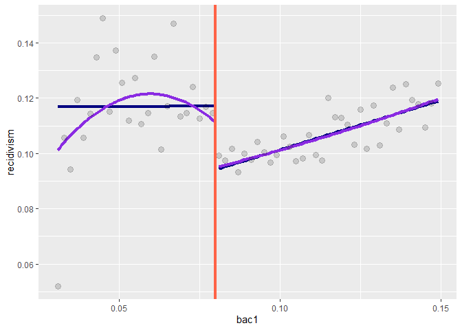

Assignment 2
================
Colin Wick
3/4/2021

Hansen (2015) uses panel BAC and police data to construct a regression
discontinuity model exploiting the “arbitrary” cutoffs of DUI
consequences at different BAC levels. The first task is establishing the
homogeneity and independence of BAC in order to validate that there is
no clustering around specific values, as shown in Figure 1. The BAC of
drivers is approximately normal with no evidence of bunching around
cutoffs.

Then, exploiting the underlying normality of BAC levels, he is able to
analyze differences between those who fell just above and just below a
given threshold and DUI recidivism. He finds a sharp drop in recidivism
along the first BAC cutoff (.08) and a weaker drop on the second.

He then does a handful of robustness checks and deeper looks into
recidivism, finding the effect is strongest for those whom had never
been tested and were caught above the .08 threshold but below the .15
threshold.

### Creating Cutoff Variables

### Testing for manipulation on the running variable

<!-- -->

    ## [1] "with P-value of McCrary tests 0.89 and 0.46 we fail to reject the null that there is no bunching around cutoffs"

Recreating Figure 1 from Hansen. A histogram of BAC shows there is no
visible evidence of bunching around either cutoff. Running the McCrary
test finds no statistical evidence either.

### Coviariate Balance on the running variable

<table class="kable_wrapper lightable-classic-2" style="font-family: &quot;Arial Narrow&quot;, &quot;Source Sans Pro&quot;, sans-serif; margin-left: auto; margin-right: auto;">
<tbody>
<tr>
<td>
<table>
<caption>
For BAC=.08
</caption>
<thead>
<tr>
<th style="text-align:left;">
</th>
<th style="text-align:right;">
male
</th>
<th style="text-align:right;">
white
</th>
<th style="text-align:right;">
age
</th>
</tr>
</thead>
<tbody>
<tr>
<td style="text-align:left;">
estimate
</td>
<td style="text-align:right;">
0.0062
</td>
<td style="text-align:right;">
0.0057
</td>
<td style="text-align:right;">
-0.1405
</td>
</tr>
<tr>
<td style="text-align:left;">
se
</td>
<td style="text-align:right;">
0.0060
</td>
<td style="text-align:right;">
0.0050
</td>
<td style="text-align:right;">
0.1640
</td>
</tr>
<tr>
<td style="text-align:left;">
mean at .079
</td>
<td style="text-align:right;">
0.7900
</td>
<td style="text-align:right;">
0.8500
</td>
<td style="text-align:right;">
34.1800
</td>
</tr>
</tbody>
</table>
</td>
<td>
<table>
<caption>
For BAC=.15
</caption>
<thead>
<tr>
<th style="text-align:left;">
</th>
<th style="text-align:right;">
male
</th>
<th style="text-align:right;">
white
</th>
<th style="text-align:right;">
age
</th>
</tr>
</thead>
<tbody>
<tr>
<td style="text-align:left;">
estimate
</td>
<td style="text-align:right;">
0.0003
</td>
<td style="text-align:right;">
0.0068
</td>
<td style="text-align:right;">
0.1152
</td>
</tr>
<tr>
<td style="text-align:left;">
se
</td>
<td style="text-align:right;">
0.0040
</td>
<td style="text-align:right;">
0.0040
</td>
<td style="text-align:right;">
0.1190
</td>
</tr>
<tr>
<td style="text-align:left;">
mean at .149
</td>
<td style="text-align:right;">
0.7900
</td>
<td style="text-align:right;">
0.8600
</td>
<td style="text-align:right;">
34.5000
</td>
</tr>
</tbody>
</table>
</td>
</tr>
</tbody>
</table>

Both through formal tests and visually there do not appear to be
manipulations of covariates around the cutoffs of the running variable.
If there were, we would expect to see gaps in the continuity of these
variables around the .08 cutoff. Rather, there are inflection points for
some variables, but no significant gaps.

### RDD Estimates

<table style="NAborder-bottom: 0; font-family: &quot;Arial Narrow&quot;, &quot;Source Sans Pro&quot;, sans-serif; margin-left: auto; margin-right: auto;" class=" lightable-classic-2">
<caption>
Regression Discontinuity Estimates for the Effect of Exceeding the .08
BAC Threshold on Recidivism
</caption>
<thead>
<tr>
<th style="text-align:left;">
</th>
<th style="text-align:left;">
Linear
</th>
<th style="text-align:left;">
Linear+Interaction
</th>
<th style="text-align:left;">
Quadratic+Interaction
</th>
</tr>
</thead>
<tbody>
<tr grouplength="4">
<td colspan="4" style="border-bottom: 1px solid;">
<strong>.05 BW, BAC in \[0.03,0.13\]</strong>
</td>
</tr>
<tr>
<td style="text-align:left;padding-left: 2em;" indentlevel="1">
DUI
</td>
<td style="text-align:left;">
-0.031
</td>
<td style="text-align:left;">
-0.024
</td>
<td style="text-align:left;">
0.028
</td>
</tr>
<tr>
<td style="text-align:left;padding-left: 2em;" indentlevel="1">
SE, robust
</td>
<td style="text-align:left;">
0.002
</td>
<td style="text-align:left;">
0
</td>
<td style="text-align:left;">
0.001
</td>
</tr>
<tr>
<td style="text-align:left;padding-left: 2em;" indentlevel="1">
Mean
</td>
<td style="text-align:left;">
0.118
</td>
<td style="text-align:left;">
0.118
</td>
<td style="text-align:left;">
0.118
</td>
</tr>
<tr>
<td style="text-align:left;padding-left: 2em;" indentlevel="1">
N
</td>
<td style="text-align:left;">
214558
</td>
<td style="text-align:left;">
214558
</td>
<td style="text-align:left;">
214558
</td>
</tr>
<tr grouplength="4">
<td colspan="4" style="border-bottom: 1px solid;">
<strong>.025 BW, BAC in \[0.055,0.105\]</strong>
</td>
</tr>
<tr>
<td style="text-align:left;padding-left: 2em;" indentlevel="1">
DUI1
</td>
<td style="text-align:left;">
-0.032
</td>
<td style="text-align:left;">
-0.024
</td>
<td style="text-align:left;">
0.028
</td>
</tr>
<tr>
<td style="text-align:left;padding-left: 2em;" indentlevel="1">
SE, robust1
</td>
<td style="text-align:left;">
0.002
</td>
<td style="text-align:left;">
0
</td>
<td style="text-align:left;">
0.001
</td>
</tr>
<tr>
<td style="text-align:left;padding-left: 2em;" indentlevel="1">
Mean1
</td>
<td style="text-align:left;">
0.118
</td>
<td style="text-align:left;">
0.118
</td>
<td style="text-align:left;">
0.118
</td>
</tr>
<tr>
<td style="text-align:left;padding-left: 2em;" indentlevel="1">
N1
</td>
<td style="text-align:left;">
214163
</td>
<td style="text-align:left;">
214163
</td>
<td style="text-align:left;">
214163
</td>
</tr>
</tbody>
<tfoot>
<tr>
<td style="padding: 0; " colspan="100%">
Note: 
</td>
</tr>
<tr>
<td style="padding: 0; " colspan="100%">
 Showing estimates for the LATE around BAC=.08 with three
specifications for increasing polynomial interactions with the running
variable. Linear merely uses a cutoff dummy as the specification, while
the following two interact the cutoff dummy with the running variable at
power 1 and 2 respectively.
</td>
</tr>
</tfoot>
</table>

### Linear and Quadratic Fit Against the .15 cutoff

<!-- -->

### Reflection

Discuss what you learned from this exercise. What was the hypothesis you
tested and what did you find? How confident are you in Hansen’s original
conclusion? Why/why not?

This exercise taught lessons on two axis; coding and theory.

In terms of causal inference (generally) and RDD design (in particular),
this assignment put into clear focus the challenges that accompany
distilling causal relationships from messy social information. In the
first histogram, I immediately noticed the near-perfect distribution of
BAC data, which was a crucial assumption for the entire empirical
process to work. In the real world, finding variables like this is
incredibly hard, especially if they are linked to other important
variables.

Following this, the RDD design was important to work through on a
practical level. From a theory perspective it is easy enough to
understand, but feeling the process of testing covariates on the running
variable testing possible bandwidths, and such were important to see.
The workflow is crystal clear. For the RDD, I felt comfortable applying
this to my semester project on the age variable in the ASEC and
tinkering with the variable to get a sense of whether an RDD would be
possible. My lingering concern is knowing what tests need to be
performed and what magnitudes are valuable/publishable. This is
partially a question of experience but this project presented a perfect
dataset.

The hypothesis Hansen works with is whether the “arbitrary” cutoff of
.08 BAC leads to a drop in recidivism. Since people do not have control
over the specific value of their BAC, that variable is essentially
random around the cutoff.

Testing against a linear and quadratic line, Hansen sees whether there
is a strong effect of breaching the .08 threshhold and finds a
significant drop. There is strong evidence to suggest a precipitous drop
(on average) if someone finds themselves “just over” the .08 BAC cutoff.
This effect decreases as increasing polynomials are introduced into the
model, which is consistent with theoretical understanding of the effects
of polynomials in linear models.

Overall, my takeaway from the paper is that there is some effect of
deterrance from people experiencing consequences. One notable element is
the upward slope of the inner line, suggesting that this deterrance
effect decreases as BAC increases. A potential narrative that solves for
this issue is the person who is “surprised” they got a DUI and changes
their behavior accordingly. However, the effect is weaker (shallow drop)
and less sticky (degrades over post-threshold BAC) to a concerning
amount. The weakness carries an implication that deterrance is only
really effective on the marginal drunk driver. Based on the demographic
breakdowns of the BAC data, it is clear that the aggregate BAC data is
composed of sub-populations with different drinking + driving propensity
and it may be the case that this effect is not distributed evenly across
the entire population (LATE is the average).

Along with the stickiness, it may be the case that, as BAC increases,
the relative share of different underlying populations changes and
contributes to the measure of recidivism. For example, BAC would be
plausibly correlated with chronic alcoholism, so those populations would
be higher represented in the higher BAC groups.
