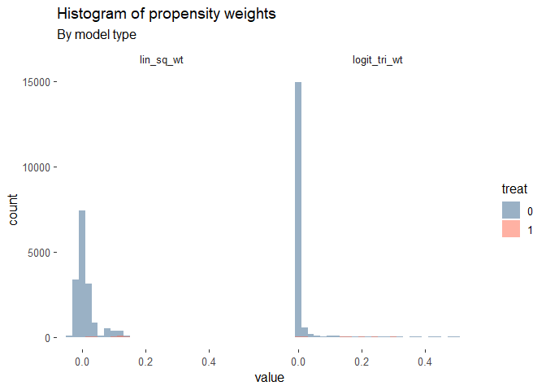
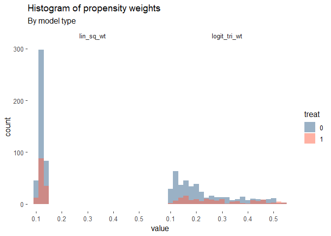

Replication 2
================
Colin Wick
4/11/2021

``` r
knitr::opts_chunk$set(warning = F,message = F)
library(tidyverse)
```

    ## -- Attaching packages --------------------------------------- tidyverse 1.3.0 --

    ## v ggplot2 3.3.3     v purrr   0.3.4
    ## v tibble  3.0.6     v dplyr   1.0.4
    ## v tidyr   1.1.2     v stringr 1.4.0
    ## v readr   1.4.0     v forcats 0.5.1

    ## -- Conflicts ------------------------------------------ tidyverse_conflicts() --
    ## x dplyr::filter() masks stats::filter()
    ## x dplyr::lag()    masks stats::lag()

``` r
library(haven)
library(ggthemes)
```

    ## Warning: package 'ggthemes' was built under R version 4.0.5

``` r
read_data <- function(df)
{
  full_path <- paste("https://raw.github.com/scunning1975/mixtape/master/", 
                     df, sep = "")
  df <- read_dta(full_path)
  return(df)
}

nsw_dw <- read_data("nsw_mixtape.dta")
```

``` r
read_data <- function(df)
{
  full_path <- paste("https://raw.github.com/scunning1975/mixtape/master/", 
                     df, sep = "")
  df <- read_dta(full_path)
  return(df)
}
nsw_dw_cpscontrol <- read_data("cps_mixtape.dta") %>%
  bind_rows(nsw_dw)

nsw_dw_cpscontrol <- nsw_dw_cpscontrol %>%
  mutate(age_sq = age^2,
         age_cube = age^3,
         educ_sq = educ^2,
         educ_cube = educ^3,
         re74_sq = re74^2,
         re74_cube = re74^3,
         re75_sq = re75^2,
         re75_cube = re75^3)
```

Setting up the equations:

``` r
sq_formula <- formula(treat ~ age + age_sq + educ + educ_sq + black + hisp + marr + nodegree + re74 + re74_sq + re75 + re75_sq)
cub_formula <- formula(treat ~ age + age_sq + age_cube + educ + educ_sq + educ_cube + black + hisp +marr + nodegree + re74 + re74_sq + re74_cube + re75 + re75_sq + re75_cube)
```

Running each model and adding predicted values to the original dataset.

``` r
linear_pscore <- lm(data=nsw_dw_cpscontrol,formula=sq_formula)
nsw_dw_cpscontrol$lin_sq_wt <- linear_pscore$fitted.values

logit_pscore <- glm(data=nsw_dw_cpscontrol,formula=cub_formula, family = binomial(link="logit"))
nsw_dw_cpscontrol$logit_tri_wt <- logit_pscore$fitted.values


nsw_dw_cpscontrol %>%
  select(logit_tri_wt,lin_sq_wt,treat) %>%
  mutate(id = row_number()) %>%
  pivot_longer(cols = c("logit_tri_wt","lin_sq_wt")) %>%
  group_by(name,treat) %>%
  summarize(min = min(value),
            max = max(value),
            avg = mean(value))
```

    ## # A tibble: 4 x 5
    ## # Groups:   name [2]
    ##   name         treat          min   max     avg
    ##   <chr>        <dbl>        <dbl> <dbl>   <dbl>
    ## 1 lin_sq_wt        0 -0.0403      0.142 0.0102 
    ## 2 lin_sq_wt        1  0.00318     0.142 0.108  
    ## 3 logit_tri_wt     0  0.000000321 0.546 0.00892
    ## 4 logit_tri_wt     1  0.00159     0.532 0.216

Each of these approaches generate a relatively tight band of predicted
weights. The highest range was the cubic logit weights.

``` r
#colors <- c("lin_sq_wt1" = "steelblue4", "lin_sq_wt0" = "navy", "logit_tri_wt1" = "darkorange1", "logit_tri_wt0" = "tomato4")
colors <- c("1"="tomato","0"="steelblue4")

nsw_dw_cpscontrol %>%
  select(logit_tri_wt,lin_sq_wt,treat) %>%
  pivot_longer(cols = c("logit_tri_wt","lin_sq_wt")) %>%
  mutate(treat = as.factor(treat)) %>%
  ggplot()+
  geom_histogram(aes(x=value,fill=treat,group=treat),
                     alpha=.5,binwidth = .02,position = "identity")+
#  geom_histogram(aes(logit_tri_wt,fill="logit_tri_wt0"),alpha=.3,binwidth = .01)+
#  geom_histogram(aes(lin_sq_wt,fill="lin_sq_wt1"),alpha=.3,binwidth = .01)+
#  geom_histogram(aes(lin_sq_wt,fill="lin_sq_wt0"),alpha=.3,binwidth = .01)+
  scale_color_manual(values = colors,aesthetics = "fill")+
  facet_grid(.~name)+
  ggtitle("Histogram of propensity weights","By model type")+
  ggthemes::theme_tufte(base_family = "sans",base_size = 12)
```

<!-- -->

## Dropping (.1,.9) bounds of propensity scores

``` r
nsw_dw_cpscontrol %>%
  filter(logit_tri_wt <= .9 & logit_tri_wt >= .1) %>%
  filter(lin_sq_wt <= .9 & lin_sq_wt >= .1) %>%
  select(logit_tri_wt,lin_sq_wt,treat) %>%
  mutate(id = row_number()) %>%
  pivot_longer(cols = c("logit_tri_wt","lin_sq_wt")) %>%
  group_by(name,treat) %>%
  summarize(min = min(value),
            max = max(value),
            avg = mean(value))
```

    ## # A tibble: 4 x 5
    ## # Groups:   name [2]
    ##   name         treat   min   max   avg
    ##   <chr>        <dbl> <dbl> <dbl> <dbl>
    ## 1 lin_sq_wt        0 0.100 0.142 0.122
    ## 2 lin_sq_wt        1 0.101 0.142 0.124
    ## 3 logit_tri_wt     0 0.100 0.546 0.232
    ## 4 logit_tri_wt     1 0.106 0.532 0.280

Each of these approaches generate a relatively tight band of predicted
weights. The highest range was the cubic logit weights.

``` r
#colors <- c("lin_sq_wt1" = "steelblue4", "lin_sq_wt0" = "navy", "logit_tri_wt1" = "darkorange1", "logit_tri_wt0" = "tomato4")
colors <- c("1"="tomato","0"="steelblue4")

nsw_dw_cpscontrol %>%
  filter(logit_tri_wt <= .9 & logit_tri_wt >= .1) %>%
  filter(lin_sq_wt <= .9 & lin_sq_wt >= .1) %>%
  select(logit_tri_wt,lin_sq_wt,treat) %>%
  pivot_longer(cols = c("logit_tri_wt","lin_sq_wt")) %>%
  mutate(treat = as.factor(treat)) %>%
  ggplot()+
  geom_histogram(aes(x=value,fill=treat,group=treat),
                     alpha=.5,binwidth = .02,position = "identity")+
#  geom_histogram(aes(logit_tri_wt,fill="logit_tri_wt0"),alpha=.3,binwidth = .01)+
#  geom_histogram(aes(lin_sq_wt,fill="lin_sq_wt1"),alpha=.3,binwidth = .01)+
#  geom_histogram(aes(lin_sq_wt,fill="lin_sq_wt0"),alpha=.3,binwidth = .01)+
  scale_color_manual(values = colors,aesthetics = "fill")+
  facet_grid(.~name)+
  ggtitle("Histogram of propensity weights","By model type")+
  ggthemes::theme_tufte(base_family = "sans",base_size = 12)
```

<!-- -->

### First-differences for each unit

``` r
mean_y1 <- nsw_dw_cpscontrol %>%
  filter(treat == 1) %>%
  filter(logit_tri_wt > .1 & logit_tri_wt < .9) %>%
  summarise(mean(re78))

mean_y0 <- nsw_dw_cpscontrol %>%
  filter(treat == 0) %>%
  filter(logit_tri_wt > .1 & logit_tri_wt < .9) %>%
  summarise(mean(re78))

first_difference <- mean_y1 - mean_y0

nsw_dw_cpscontrol %>%
  filter(logit_tri_wt <= .9 & logit_tri_wt >= .1) %>%
  mutate(y1 = weighted.mean(nsw_dw_cpscontrol$re78[nsw_dw_cpscontrol$treat == 1],
                            nsw_dw_cpscontrol$logit_tri_wt[nsw_dw_cpscontrol$treat == 1]),
         y0 = weighted.mean(nsw_dw_cpscontrol$re78[nsw_dw_cpscontrol$treat == 0],
                            nsw_dw_cpscontrol$logit_tri_wt[nsw_dw_cpscontrol$treat == 0])) %>%
  summarize(y1 = unique(y1),
            y0 = unique(y0),
            weighted_first_diff = y1 - y0,
            basic_first_difference = first_difference[1,1]) %>%
  data.frame()
```

    ##         y1       y0 weighted_first_diff basic_first_difference
    ## 1 6126.545 5283.962            842.5834               1491.928

### Weighted Difference-in-differences

``` r
nsw_dw_cpscontrol = nsw_dw_cpscontrol %>%
  mutate(p_weight = 1/logit_tri_wt)

p_dt1 <- mean(nsw_dw_cpscontrol$logit_tri_wt)

nsw_dw_cpscontrol %>%
  mutate(estimator = (re78 - re75)/p_dt1 * (treat - logit_tri_wt) / (1-logit_tri_wt)) %>%
  summarise(estimator = mean(estimator),
            sd = sd(estimator)/sqrt(n())) %>% data.frame()
```

    ##   estimator sd
    ## 1  1121.123 NA
